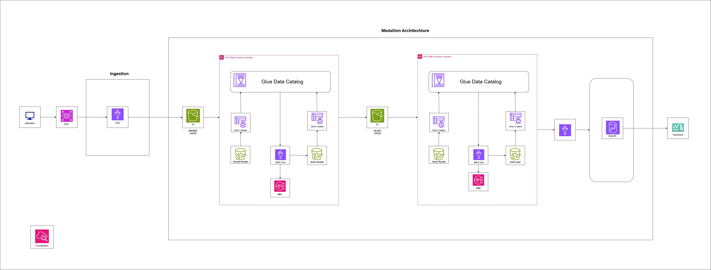

# Proximity-Based Service Platform Analytics Lakehouse

## 1 Overview
This project implements a lakehouse-based data pipeline for a proximity-based service provider platform. It leverages AWS Glue, S3, Redshift, Step Functions, and Power BI to deliver scalable and automated analytics for bookings and service provider performance.

## 2 Architecture
The architecture follows a Medallion Architecture model, processing data from PostgreSQL to a Power BI dashboard. In the architecture, the data is saved to an S3 bucket after every successful transformation is completed.



## 3 Infrastructure (Terraform)
The infrastructure is provisioned using Terraform, ensuring reproducibility and scalability.

### 3.1 S3 Buckets
S3 buckets are used to store data extracted from the RDS as parquet files:
- `prox-bronze-bucket`: Stores raw data (Bronze)
- `prox-silver-bucket`: Stores cleaned data (Silver)
- `prox-gold-bucket`: Stores star schema data (Gold)

### 3.2 AWS Glue
AWS Glue is a tool that is used to perform ETL (Extract, Transform, Load):
- **Crawlers**: bronze_crawler, silver_crawler, gold_crawler
- **Jobs**:
  - bronze-ingestion-job: Extracts data from RDS to Bronze
  - transformations-job: Processes Bronze to Silver
  - gold-data-curation-job: Creates star schema in Gold
  - s3-to-redshift-job: Loads Gold data to Redshift

### 3.3 Redshift
Redshift is a data warehouse:
- Configured with VPC, Subnet Group, and Security Group
- Cluster with public schema
- Fact and dimension tables created using compatible DDL

### 3.4 IAM Roles
Access that makes services assume the role of a user:
- Roles for Glue and Redshift with scoped S3 access

### 3.5 SNS
Allows notifications to be sent to users:
- Topic: prox-notifications for Step Functions alerts

## 4 ETL Pipeline
The ETL pipeline processes data through Bronze, Silver, and Gold layers before loading into Redshift.

### 4.1 Bronze Layer (Raw Data Ingestion)
- **Job**: bronze-ingestion-job
- Extracts data from RDS (PostgreSQL) using JDBC
- Writes CSV/JSON to prox-bronze-bucket
- Crawled by bronze_crawler

### 4.2 Silver Layer (Data Cleaning & Validation)
- **Job**: transformations-job
- Reads Bronze data via Glue catalog
- Enforces schema, checks foreign keys, deduplicates
- Writes Parquet to prox-silver-bucket
- Crawled by silver_crawler

### 4.3 Gold Layer (Star Schema)
- **Job**: gold-data-curation-job
- Creates fact and dimension tables:
  - fact_booking
  - dim_user, dim_service, dim_location, dim_dispute, dim_review, dim_date
- Stored in prox-gold-bucket as Parquet
- Crawled by gold_crawler

### 4.4 Load to Redshift
- **Job**: s3-to-redshift-job
- Checks for table existence, creates if absent
- Uses from_jdbc.conf() with Redshift JDBC (IAM role)
- Loads Parquet files from prox-gold-bucket to Redshift public schema

## 5 Orchestration (AWS Step Functions)
A Step Function orchestrates the ETL pipeline with the following flow:

1. Bronze Ingestion Job
2. Crawl Bronze
3. Silver Transformation Job
4. Crawl Silver
5. Gold Curation Job
6. Crawl Gold
7. Load to Redshift
8. SNS Success Notification

- Includes wait and status checks for crawlers using getCrawler
- Applies retries and backoff strategies to Glue/Crawler tasks
- Failure paths send notifications to prox-notifications SNS topic

## 6 CI/CD Pipelines
CI/CD is implemented using GitHub Actions for automated deployment and validation.

### 6.1 Main Branch
- Deploys Glue scripts to S3 buckets:
  - Bronze: bronze_ingestion_script.py, transformations_script.py
  - Gold: gold_data_curation_script.py, s3_to_redshift_script.py
- Workflow:
  - Retrieves bucket names using terraform output
  - Checks bucket existence
  - Uploads/updates scripts using aws s3 cp
- Runs on push or pull request to main

### 6.2 Test Branch
- Validates Terraform code with terraform fmt, init, and validate
- Runs on push or pull request to test

## 7 Power BI Dashboard (Booking Insights)
The dashboard provides insights into booking data using Redshift in Import Mode.

### 7.1 Data Source
- Redshift tables: fact_booking, dim_user, dim_date, dim_service, dim_location, dim_dispute, dim_review

### 7.2 Page: Booking Insights

#### 7.2.1 Slicers (Left Sidebar)
- Date: dim_date[full_date]
- User Type: dim_user[user_type]
- Service Category: dim_service[category]
- Location: dim_location[city]

#### 7.2.2 Visuals
| Visual | Type | Fields Used |
|--------|------|-------------|
| Total Bookings | Card | fact_booking[booking_id] |
| Revenue Generated | Card | fact_booking[booking_fee] |
| Bookings Over Time | Line Chart | Axis: dim_date[full_date], Values: Total Booking |
| Top 5 Cities by Bookings | Bar Chart | Axis: dim_location[city], Values: Total Bookings |
| Booking Status Breakdown | Donut Chart | fact_booking[booking_status], Total Bookings |
| Avg Booking Fee per Category | Bar Chart | Axis: dim_service[category], Values: Avg Booking |

## 8 Security
- Glue jobs run with IAM roles scoped to necessary actions
- SNS notifications replace direct error failures
- GitHub Secrets used for AWS credentials in CI/CD

## 9 Deployment Instructions

### 9.1 Clone the Repository
```bash
git clone https://github.com/Andrew-Marfo/PROX.git
```

### 9.2 Provision Infrastructure
```bash
terraform init
terraform plan
terraform apply
```

### 9.3 Trigger CI/CD
- Push to main: Deploys Glue scripts
- Push to test: Validates Terraform code

### 9.4 Execute Step Function
- Start execution from the AWS Console
- Confirm success via SNS or CloudWatch logs

### 9.5 Power BI
- Connect to Redshift cluster
- Import all dim_and fact_tables
- Create reports and dashboards
- Use visuals/DAX as specified in Booking Insights